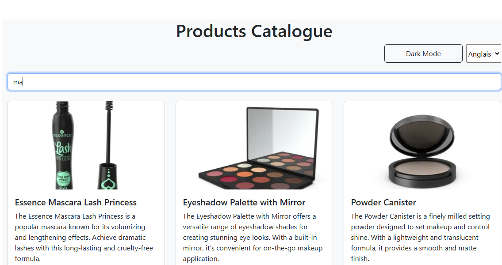
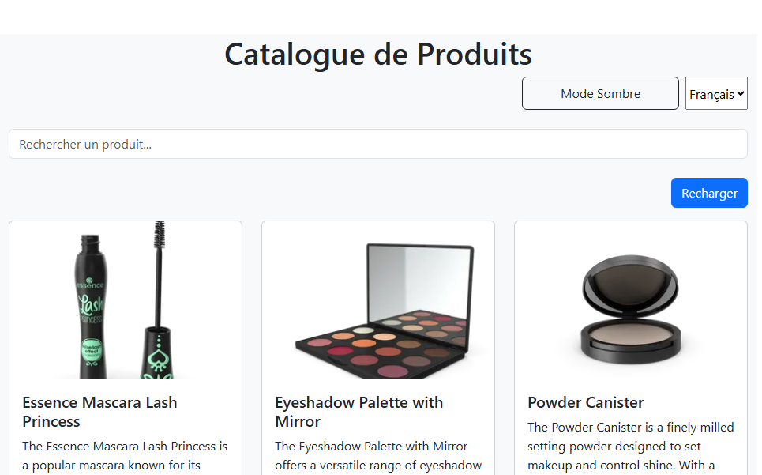
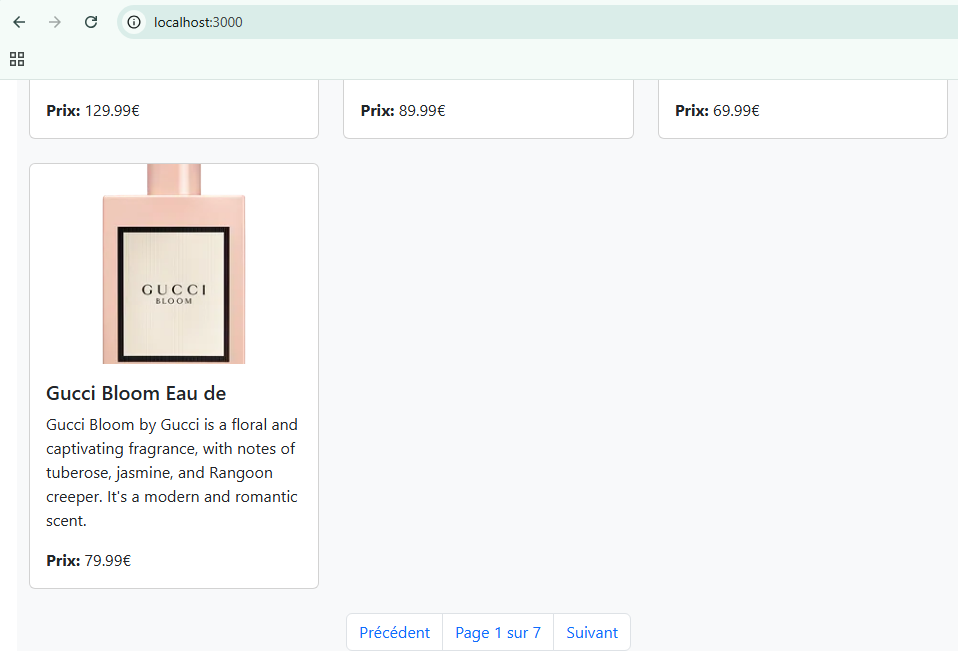

# TP React Hooks - Application de Gestion de Produits

Ce TP a pour objectif de mettre en pratique l'utilisation des Hooks React (useState, useEffect, useContext) ainsi que la création de Hooks personnalisés.

## Installation et configuration initiale

1. Cloner le dépôt :
```bash
git clone https://github.com/pr-daaif/tp-react-hooks.git
cd tp-react-hooks
```

2. Créer votre propre dépôt sur Github et changer le remote :
```bash
# Supprimer le remote origine
git remote remove origin

# Ajouter votre nouveau remote
git remote add origin https://github.com/[votre-username]/tp-react-hooks.git

# Premier push
git push -u origin main
```

3. Installer les dépendances :
```bash
npm install
```

4. Lancer l'application :
```bash
npm start
```

## Instructions pour le TP

Pour chaque exercice :
1. Lisez attentivement l'énoncé
2. Implémentez la solution
3. Testez votre implémentation (pensez à faire des copies d'écran)
4. Mettez à jour la section correspondante dans ce README avec :
   - Une brève explication de votre solution
   - Des captures d'écran montrant le fonctionnement
   - Les difficultés rencontrées et comment vous les avez résolues
5. Commitez vos changements avec un message descriptif

### Exercice 1 : État et Effets 
#### Objectif : Implémenter une recherche en temps réel

- [ ] 1.1 Modifier le composant ProductSearch pour utiliser la recherche
- [ ] 1.2 Implémenter le debounce sur la recherche
- [ ] 1.3 Documenter votre solution ici

#### Réponses :

**1 - Modification du composant ProductSearch pour effectuer la recherche :**


Pour implémenter la recherche, j'ai utilisé la technique de "props drilling", cette solution consiste à faire remonter l'état dans le composant parent, puis de la faire passer comme propriété aux différents composants enfants qui ont besoin de cette dernière. 
Dans notre cas la technique de "props drilling" est considérée comme la meilleur solution puisque les composants enfants qui ont besoin de cet état sont des enfants directs du composant parent qui maintient cet état.

**2 - Implémentation du debounce sur la recherche :**


Pour implémenter le debounce sur la recherche qui consiste à retarder l'exécution d'une fonction ou l'appel à une API par quelques ms, j'ai procédé de la façon suivante : 
1. Ajouter un autre état `debounce` sur lequel on va se baser pour éffectuer la recherche
2. Implémenter un `useEffect` qui mettera à jour l'état `debounce` à chaque fois que l'état `searchTerm` est modifiée, cette mise à jour sera effectuée de façon retardée par 500ms en utilisant la fonction `setTimeout()`, et qui retournera une fonction `cleanup()` pour effacer le précedent `setTimeout` pour chaque nouvelle mise à jour de `searchTerm`
3. Injecter `debounce` au lieu de `searchTerm` comme propriété du composant `ProductList`

**Problèmes rencontrés et solutions :** 

<ul>
<li><b>Problème :</b> L'exécution de la recherche cause plusieurs invocations de la méthode filter()</li>
<li><b>Solution :</b> Utilisation du debounce sur la recherche via un setTimeout et clearTimeout` pour retarder les appels à la fonction filter()</li>
</ul>


### Exercice 2 : Context et Internationalisation
#### Objectif : Gérer les préférences de langue

- [ ] 2.1 Créer le LanguageContext
- [ ] 2.2 Ajouter le sélecteur de langue
- [ ] 2.3 Documenter votre solution ici

#### Réponse :

1 - Création du context LanguageContext qui se compose de l'état `language` qui stock la langue actuelle et `setLanguage` qui modifie cet état, et qui retourne un `LanguageContext Provider` qui fournit `language` et `setLanguage`: 


2 - Ajout du selecteur du langue (le composant `LanguageSelector`) qui va utiliser `setLanguage` fourni par le `LanguageContextProvider` pour mettre à jour l'état `language` à chaque fois où l'utilisateur séléctionne une nouvelle option (français ou anglais) 


3 - Enfin pour que toute l'application pourra être afféctée par la langue choisi, j'ai entourer le composant `App.js` par le `LanguageContext.Provider`


**Demonstration :**

a - L'utilisateur selectionne la langue française :


b - L'utilisateur selectionne la langue anglaise :


### Exercice 3 : Hooks Personnalisés
#### Objectif : Créer des hooks réutilisables

- [ ] 3.1 Créer le hook useDebounce
- [ ] 3.2 Créer le hook useLocalStorage
- [ ] 3.3 Documenter votre solution ici

#### Réponses : 

**1. useDebounce() :** permet d'avoir un comportement réutilisable qui retarde les appels aux fonctions et aux API


**2. useLocalStorage() :** permet d'avoir un comportement réutilisable sui sert à stocker et lire la langue de préférence depuis `LocaleStorage` ce qui permet de maintenir cette valeur même si l'utilisateur actualise la page web.


#### Démonstration : 

**useDebouce() Hook :**

1 - recherche via le hook useDebouce() (juste après la saisie du critère de recherche): 



2 - recherche via le hook useDebouce() (juste après le découlement de 1000 ms après la saisi): 


**useLocalStorage() Hook :**

1 - utilisation de useLocalStorage() pour stocker et consommer la langue de préference de l'utilisateur :


### Exercice 4 : Gestion Asynchrone et Pagination
#### Objectif : Gérer le chargement et la pagination

- [ ] 4.1 Ajouter le bouton de rechargement
- [ ] 4.2 Implémenter la pagination
- [ ] 4.3 Documenter votre solution ici

#### Réponses : 

**1. Fonctionnalité de rechargement :**


1 - l'utilisateur utilise la langue anglaise comme langue de préférence 


<br/>

2 - l'utilisateur utilise la langue française comme langue de préférence 


<br/>

3 - Rechargement lors du clique sur le bouton "Recharger"


<br/>

4 - Après rechargement


<br/>

5 - Explication de la démarche de l'implémentation

- Deplacement du fetchProducts en dehors du hook useEffect afin qu'il puisse ètre réutilisé.
- setLoading true : cela garantit que le spinner apparaît lors de la récupération des données, même pendant un rechargement.
- une fois la récupération est terminée ou échouée, setloading to false, garantissant un retour visuel précis.
- en appelant fetchProducts, il actualise efficacement la liste des produits tout en affichant le spinner.
- La fonction reload appelle désormais directement fetchProducts, garantissant qu'elle fonctionne sans dupliquer la logique.
- appel useEffect : utilise toujours fetchProducts pour la récupération initiale des données lorsque le composant est monté.
- Ajout button recharger au ProductList component.

<br/>

**2 - Fonctionnalité de la pagination :**

1 - Page numéro 1 :


1 - Page suivante :


3 - Page précedente : 




#### Rendu

- Ajoutez l'URL de votre dépôt Github dans  **Classroom** et envoyer la réponse dès le démarage de votre projet.
- Les push doivent se faire au fûr et à mesure que vous avancez dans votre projet.
- Le README.md doit être à jour avec vos réponses et captures d'écran. 
- Chaques exercice doit faire l'objet d'au moins un commit avec un message mentionnant le numéro de l'exercice.
